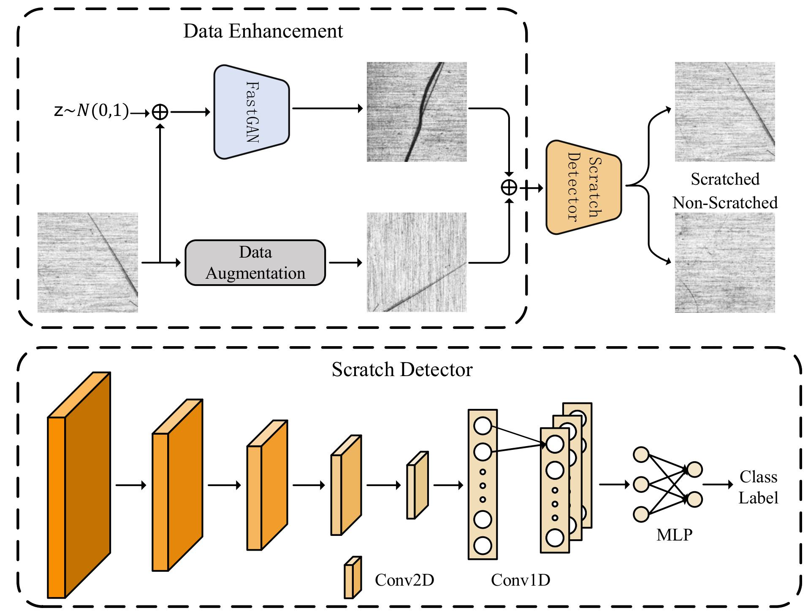

# Automotive Scratch Detection: A Lightweight Convolutional Network Approach Augmented by Generative Adversarial Learning

<p align="center">
  
</p>

The growing demand for high-precision machining and inspection in modern manufacturing has positioned machine vision as a key technology for surface defect detection.
However, identifying subtle surface scratches on automotive components remains a challenging task due to the stringent requirements on sensitivity, precision, and robustness against complex background interference.
\rev{In this paper, we propose an automated detection system with a Convolutional Neural Network (CNN) architecture. 
To address data scarcity, we construct a large-scale, high-quality dataset using both data augmentation and Generative Adversarial Network (GAN)-based synthesis.}
Furthermore, the proposed lightweight CNN replaces traditional fully connected layers with one-dimensional convolutional layers to reduce parameter complexity and model size, while a Dropout mechanism is incorporated to mitigate overfitting and enhance generalization.
Experimental results demonstrate that the proposed model achieves superior detection accuracy and robustness across diverse imaging conditions.
Moreover, the developed system effectively addresses the limitations of data insufficiency and model complexity, offering an efficient and automated solution for surface quality inspection in industrial manufacturing. 

## 🧩 Dataset

The dataset used in this work is publicly available on Hugging Face:  
👉 [Ying-II / ASDE](https://huggingface.co/datasets/Ying-II/ASDE)

It contains high-resolution images for surface defect detection, covering both real and synthetic samples of automotive components such as body panels, engine blocks, and gear surfaces.

---

## 🚀 Getting Started

### 1️⃣ Training the Model
To start training the model, run the following command in the project root directory:
```bash
python train.py
 ```
### 2️⃣ Test the Model
After the training is completed, evaluate the model using:
```bash
python test.py
```

The training and testing results (e.g., accuracy, loss curves, and confusion matrix) will be automatically saved in the `results/` directory.

---

